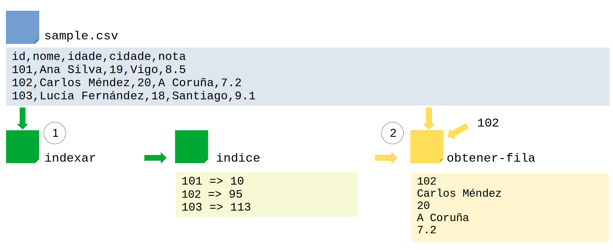

## De ler a indexar

- **Tempo total estimado**: 115'

Esta proposta de tarefa ten como obxectivo que o alumnado resolva o problema de acceder a unha fila dun ficheiro CSV a partir do valor dunha columna (un identificador).

A nivel de pensamento, a principal cuestión é como atopar a fila asociada ao identificador proporcionado: isto pode resolverse dun xeito ou outro en función de se o ficheiro está ordenado por esa columna (busca binaria) ou non (busca secuencial). Afrontarse a este problema permitirá introducir o concepto de complexidade temporal. Tras as primeiras solucións, encamiñarase a tarefa á creación dun índice que permita acceder en tempo constante (O(1)) á fila seleccionada.

A nivel técnico, o alumnado debe estar familiarizado co procesamento de ficheiros (acceso secuencial) e dicionarios, o cal permitiralles afrontar a creación do índice e un posterior acceso directo ao ficheiro.

### Desenvolvemento da sesión

#### Fase 1: Activación e exploración do enunciado

- **Tempo estimado**: 5'

Comézase a sesión repartindo unha copia impresa do seguinte ficheiro CSV e explícaselles que consiste nunha pequena base de datos na que o seu obxectivo é atopar a información dun estudante dado o seu ID, lendo o ficheiro liña a liña.

```csv
id,nome,idade,cidade,nota
101,Ana Silva,19,Vigo,8.5
102,Carlos Méndez,20,A Coruña,7.2
103,Lucía Fernández,18,Santiago,9.1
104,Marcos López,21,Ourense,6.8
105,Sara Rodríguez,19,Pontevedra,8.0
106,Diego Rama,20,Ferrol,7.5
107,Marta González,19,Lugo,8.8
108,Pablo Núñez,18,Vigo,6.5
109,Carmen Vidal,21,Santiago,9.0
110,Raúl Campos,19,A Coruña,7.8
111,Laura Prado,20,Pontevedra,8.3
112,Javier Torres,18,Ourense,7.0
113,Elena Varela,19,Vigo,9.2
114,Miguel Castro,21,Santiago,6.9
115,Noa Pérez,20,A Coruña,8.6
116,David Iglesias,19,Ferrol,7.4
117,Sofía Ríos,18,Lugo,8.1
118,Adrián Suárez,20,Vigo,7.7
119,Claudia Martín,19,Pontevedra,9.3
120,Bruno Soto,21,Santiago,6.6
121,Iria Blanco,18,A Coruña,8.9
122,Daniel Regueiro,20,Ourense,7.3
123,Andrea Moure,19,Vigo,8.4
124,Sergio Lima,21,Ferrol,7.1
125,Patricia Vázquez,20,Santiago,9.4
```

É importante salientar CSV proporcionado está ordenado por ID. É posible que algún grupo detecte esta característica e propoña explotala, por exemplo, parando a busca cando o ID sexa maior que o buscado, ou incluso suxerindo unha busca binaria. Se isto acontece, debe valorarse moi positivamente como observación aguda e pode animarse ao alumnado a profundizar nesta vía, inda que o obxectivo da sesión é centrarse no contraste entre busca secuencial completa e acceso directo ao ficheiro por índice (dicionario).

#### Fase 2: Análise do proceso

- **Tempo estimado**: 20'

O obxectivo nesta fase é que cada grupo atope algúns IDs concretos no CSV. Por exemplo, poden anotarse estes no taboleiro do docente para ter como referencia e que traten de identificar os pasos necesarios para buscalo:

- 103 (Lucía Fernández) ao principio da lista
- 115 (Noa Pérez) no medio
- 125 (Patricia Vázquez) ao final
- 130 ID inexistente (para provocar reflexión sobre condicións de parada)

Como de costume, é importante indicar que nesta fase **non se permite escribir código**, só linguaxe natural, pseudocódigo ou debuxos que expresen o proceso computacional (por exemplo, para desenvolver os casos de proba anteriores).

Ao observar como avanzan no pensamento, o profesorado pode ir facendo as seguintes preguntas para fomentar o pensamento:

- Que significa "buscar rapidamente"?
- Como o fariades se o CSV tivese 10.000 liñas?
- Que pasos seguiría un programa? E unha persoa?

#### Fase 3: Primeira posta en común

- **Tempo estimado**: 10'

Nesta fase trátase de verbalizar o proceso e identificar elementos comúns entre os grupos. Pode pedirse a cada grupo que presente brevemente o seu método (un par de minutos) de xeito que o docente escribe na pizarra as categorías que aparecen: lectura liña a liña, busca visual, marcas ou mini-índices manuais, comparacións, revisións, etc.

O importante é que emerxa a noción de lectura secuencial e o custo *O(n)* de buscar liña a liña. Pode introducirse a complexidade computacional sen mencionala explicitamente con estas preguntas:

- Cantas operacións fixestes ata atopar o último?
- Poderíades facelo máis rápido se gardásedes algo?

Se xorde o feito de que o ficheiro está ordenado pode aproveitarse para introducir a busca binaria e o número de comparacións requirido para elo.

Tras esta posta en común, o docente trata de que emerxa a idea de crear un índice e o salto conceptual cara ao acceso O(1). É importante que o alumnado comprenda que é posible acceder directamente a un rexistro dun ficheiro, en contraste co acceso secuencial.

#### Fase 4: Deseño do índice

- **Tempo estimado**: 15'

Nesta fase afóndase na conexión entre o proceso manual e a noción de complexidade e estrutura de datos. Por tanto, agora pídese aos grupos que deseñen un sistema que permita gardar as posicións dos rexistros para acceder directamente por ID. O docente fai as seguintes preguntas:

- Como se desenvolve o proceso?
- Que datos é preciso gardar?
- Que estruturas de datos coñecidas deberían empregarse para isto?
- Canto tempo require a creación do índice e o posterior acceso?

#### Fase 5: Segunda posta en común

- **Tempo estimado**: 10'

Nesta segunda posta en común o docente asegúrase de que o alumnado entende os conceptos vistos ata o momento, é dicir, consolida os coñecementos vistos ata o momento:

- Ler fila a fila → tempo proporcional a n → O(n).
- Crear un dicionario `{id: posición}` → acceso directo → O(1).
- Comparativa das solucións: máis tempo ao principio, menos nas buscas.

Pode axudar o emprego dunha metáfora e asemellar o proceso ao índice dun libro: nel é posible ir páxina por páxina ata atopar o tema que buscan (*O(n)*, onde *n* é o número de páxinas), ou ben consultar o índice alfabético ao final, que indica directamente en que páxina está (*O(1)*).

#### Fase 6: Deseño do fluxo

- **Tempo estimado**: 15'

Nesta fase o docente pedirá ao alumnado que debuxe o proceso completo: que ocorre desde que se proporcionan o ficheiro e o ID a buscar ata obter un resultado. Deben debuxar un diagrama de fluxo e en paralelo identificar as funcións que vaian a crear para implementar dito fluxo, é dicir, o mapeo a funcións. Por exemplo:

- `ler_csv(ruta) → lista_de_liñas`
- `crear_indice(lista) → dict_id_a_posicion`
- `buscar_por_id(id, indice) → liña`

De forma xeral, o esquema do programa sería o seguinte, onde *indexar* e *obtener-fila* poderían ser as funcións xerais (ou scripts, no caso de Python) de entrada ao programa. O alumnado deberá identificar tamén as funcións que inclúen dentro de cada unha delas.



#### Fase 7: Implementación e proba

- **Tempo estimado**: 30'

Nesta fase realizarase unha implementación individual ou en grupos do programa baseándose no deseño previo das funcións. A maioría do alumnado debería ter unha solución funcional neste tempo, xa que o traballo de análise e deseño previo facilita moito a codificación.

#### Fase 8: Reflexión metacognitiva

- **Tempo estimado**: 10' (en grupo) ou individual (fóra da aula)

Esta fase de peche permite que o alumnado tome consciencia do seu propio proceso de aprendizaxe. O obxectivo é que o alumno poña de manifesto o aprendido non só sobre o problema en sí, senón tamén sobre **como pensa cando resolve problemas**, de xeito que sexa capaz de identificar os seus propios puntos fortes e áreas de mellora. Dependendo de se a implementación realízase en aula ou fóra dela, esta reflexión pode ser grupal ou individual.

Na aula, o docente reúne de novo aos grupos ou á clase completa para unha conversa guiada sobre o proceso completo. Algunhas preguntas clave:

- **Sobre o proceso de pensamento:**
  - "Que foi o máis difícil de pensar neste problema?"
  - "En que momento vos 'cadrou' o problema? Que foi o 'clic'?"
  - "Que descubristes que non sabías ao comezo?"

- **Sobre a brecha entre pensar e codificar:**
  - "Houbo diferenzas entre o que pensabades que funcionaría e o que realmente funcionou ao programar?"
  - "Que erros vos sorprenderon ao implementar?"
  - "Algo que vos parecía sinxelo resultou ser complicado? Por que?"

- **Sobre aprendizaxes transferibles:**
  - "Que estratexia ou idea deste problema poderiades usar noutros?"
  - "Se tivésedes que explicarlle a alguén a parte máis importante, cal sería?"

Se a implementación é realizada fóra da aula, podería facerse a reflexión anterior ao comezo da seguinte sesión ou ben pedirlles unha breve reflexión escrita (5-10 liñas) que acompañe ao código entregado, respondendo a 2-3 das preguntas anteriores. Isto axuda a consolidar o aprendido e proporciona información valiosa ao docente sobre as dificultades reais do alumnado.

### Posibles ampliacións

Pequenas ampliacións que se poderían facer:

- Implementar un mecanismo para engadir ou eliminar rexistros do CSV e manter o índice actualizado.
- Implementar a versión con busca binaria, aprovechando o feito de que o CSV está ordenado.
- Engadir validación e manexo de erros: ID inexistente, ficheiro danado, acceso fora de límites.
- Permitir buscas por outras columnas (nome, cidade) e crear múltiples índices.
- Medir experimentalmente a diferenza de rendemento entre busca secuencial e acceso con índice con ficheiros de 100, 1000 e 10.000 liñas.
